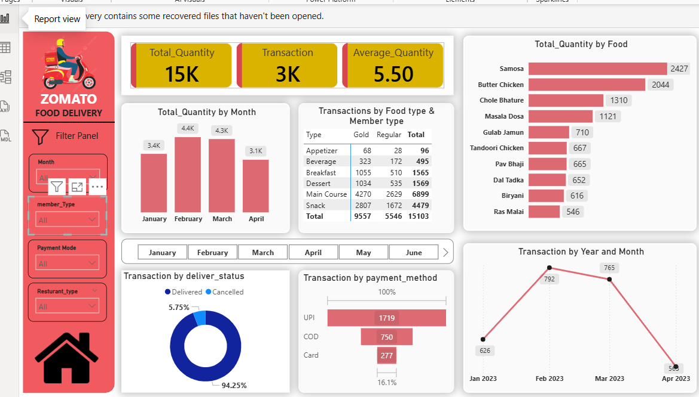

**🍽️ Zomato Food Delivery Dashboard | Power BI**

An interactive Business Intelligence Dashboard built using Power BI to analyze Zomato food delivery operations. The dashboard transforms raw transactional data into meaningful business insights, enabling stakeholders to monitor key performance indicators (KPIs), understand customer behavior, evaluate delivery performance, and support data-driven decision-making.

**📌 Table of Contents**

[Project Overview](#project-overview)

[Business Problem](#business-problem)

[Dataset Overview](#dataset-overview)

[Dashboard Preview](#dashboard-preview)

[Key Performance Indicators (KPIs)](#key-performance-indicators-kpis)

[Dashboard Features](#dashboard-features)

[Business Questions Answered](#business-questions-answered)

[Tools & Technologies](#tools--technologies)

[Project Workflow](#project-workflow)

[Key Business Insights](#key-business-insights)

[Business Recommendations](#business-recommendations)

[Project Structure](#project-structure)

[How to Use](#how-to-use)

[Author](#author)

**📖 Project Overview**

The Zomato Food Delivery Dashboard provides an end-to-end analysis of food delivery operations using Power BI. It enables business users to monitor customer orders, delivery performance, food demand, payment preferences, and customer segmentation through an interactive dashboard.

The objective of this project is to convert raw food delivery data into actionable business insights that help management improve operational efficiency, customer satisfaction, and overall business performance.

**🎯 Business Problem**

Food delivery companies process thousands of customer orders every day. Managing this large volume of transactional data manually makes it difficult to monitor business performance and identify improvement opportunities.

This dashboard addresses the following business challenges:

* Identify best-selling and low-selling food items.
* Analyze monthly ordering trends.
* Monitor delivery success and cancellation rates.
* Understand customer payment preferences.
* Compare Gold and Regular customer behavior.
* Track operational KPIs through a centralized dashboard.
* Support faster and data-driven business decisions.

**📂 Dataset Overview**

The dataset contains food delivery transaction data, including:

* Order Month

* Food Item

* Food Category

* Customer Membership Type

* Payment Method

* Delivery Status

* Quantity Ordered

* Transaction ID

* Restaurant Type

**🛠 Tools & Technologies**

* Visualization-Power BI

* Data Cleaning-Power Query

* Data Modeling-Power BI Data Model

* Calculations-DAX

* Data Source-Excel Dataset

**📁 Project Structure**

```

zomato-food-delivery-dashboard/
|
|-README.md
|-Food_Delivery_Case study_Report
|
|-Sample data/
| |-Sales data                         # Excel
|      |-January_Sales_2023.xlsx
|      |-February_Sales_2023.xlsx
|      |-March_Sales_2023.xlsx
|      |-April_Sales_2023.xlsx
|  |-Zomato data                       # Excel
|
|-image/
| |-Dashboard
|
|-output/
| |-Food Delivery                      # Power Bi
|

```

**📊 Key Performance Indicators (KPIs)**

* Total Quantity-15K

* Total Transactions-3K

* Average Quantity-5.50

* Delivery Success Rate-94.25%

* Cancellation Rate-5.75%

**📸 Dashboard Preview**

<a href="screenshots/dashboard.png">
  
</a>
